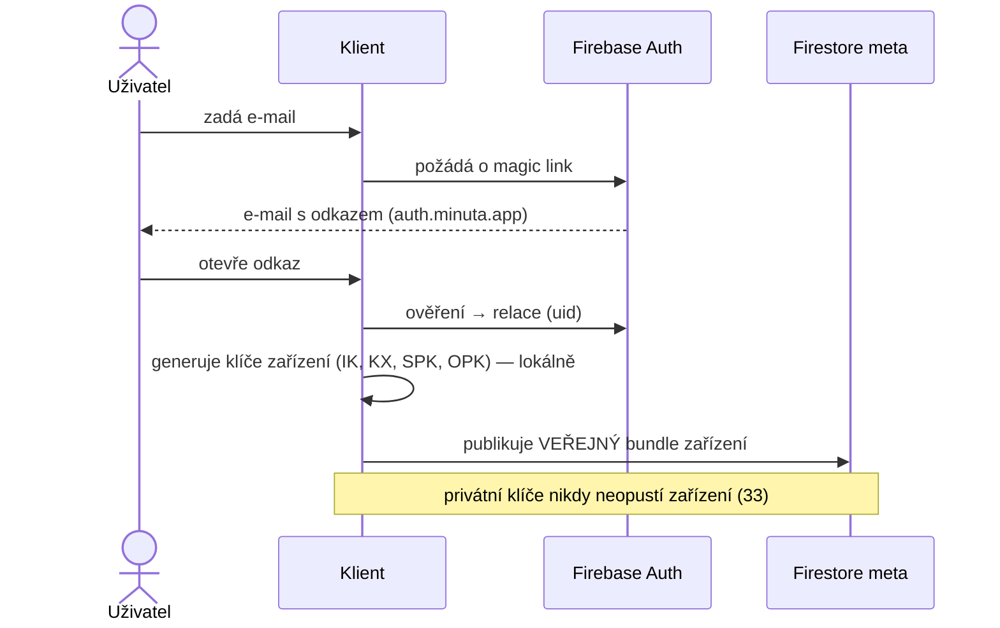
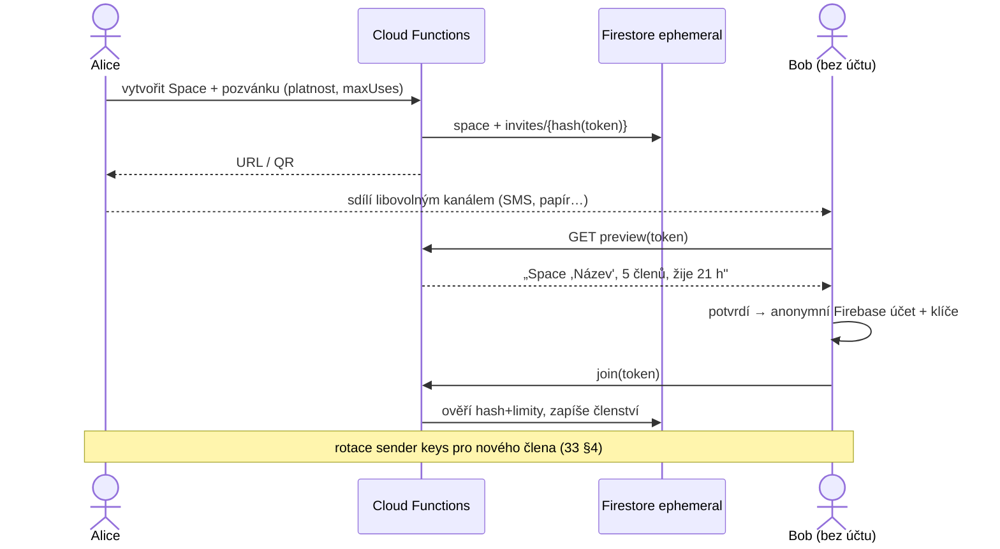
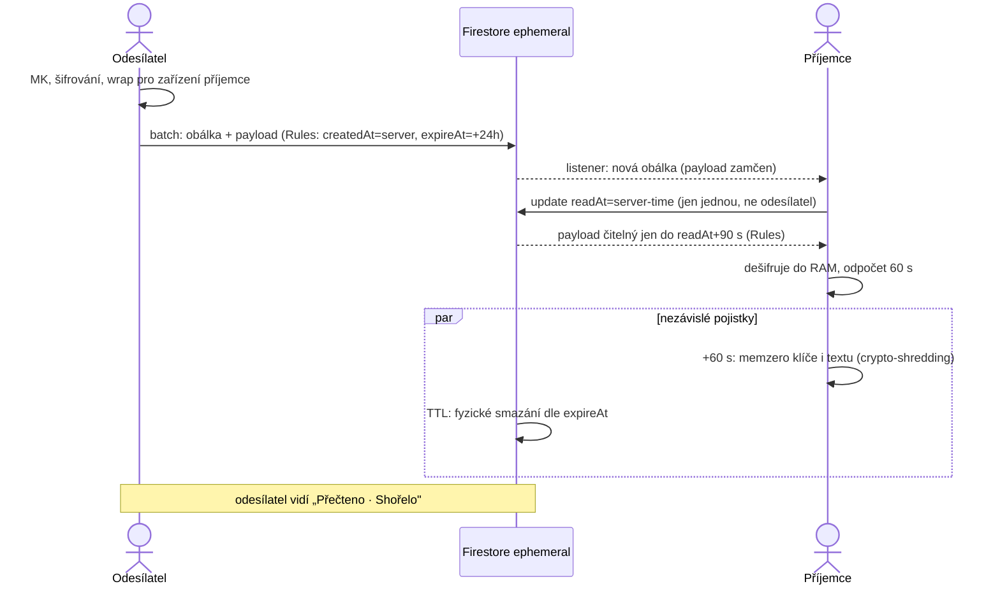
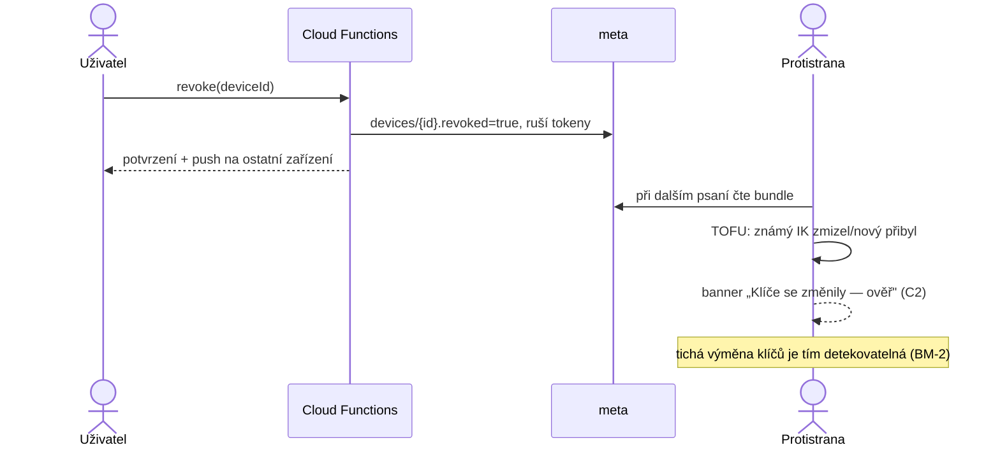
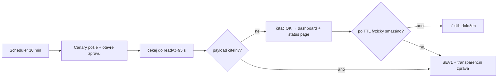

# 47 — DIAGRAMS (Draft v0.1)

Status: Draft. Sekvenční diagramy klíčových toků (slib z 24). Mermaid —
vykreslí se na GitHubu i v artefaktech. Zdroj pravdy jsou kapitoly,
diagram je ilustrace.

## D1 — Přihlášení a registrace zařízení (07, 37)



## D2 — Pozvánka a vstup do Space (12, N4)



## D3 — Život zprávy: odeslání → otevření → spálení (33, 34, 36)



## D4 — Revokace zařízení a key change (37)



## D5 — Nahlášení zprávy (27, 29)

```mermaid
sequenceDiagram
  actor R as Příjemce (nahlašující)
  participant C as Klient
  participant MP as Moderační projekt
  participant Q as Fronta (Backstage)
  R->>C: Nahlásit (v okně viditelnosti) + kategorie
  C->>C: se souhlasem dešifruje obsah jako důkaz
  C->>MP: report{důkaz šifrovaně, kategorie, meta}
  MP->>Q: zařazení dle priority (SLA 24)
  Note over Q: důkaz rozostřen; odkrytí i rozhodnutí → audit log,<br/>sankce = čtyři oči (44 §3)
```

## D6 — Expiry canary (20)



## Budoucí diagramy

- Multi-device wrap (33 §2 pro N zařízení) · Downgrade tarifu (41 §2) ·
  DSR výmaz kaskáda (35) · Force update stavový diagram (20)
